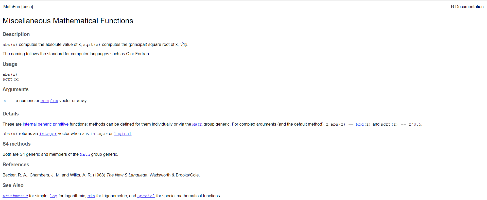

```{r setup, include=FALSE}
options(htmltools.dir.version = FALSE)
knitr::opts_chunk$set(
 # fig.width=9, fig.height=3.5,
  #fig.retina=3,
 # out.width = "100%",
  cache = FALSE,
  echo = TRUE,
  message = FALSE, 
  warning = FALSE,
  hiline = TRUE
)
```


```{r xaringan-themer, include=FALSE, warning=FALSE}
library(xaringanthemer)
library(xaringanExtra)

# style_duo_accent(
#   primary_color = "#d90502",
#   secondary_color = "black",
#   inverse_header_color = "white",
#   #header_font_google = google_font("Roboto"),
#   #text_font_google   = google_font("Montserrat", "300", "300i"),
#   #code_font_google   = google_font("Fira Mono"),
#   link_color = "#070a4a",  
#   link_decoration = "none"
# )
```

## Kit de supervivencia para datos: ¿qué hacer si tengo un error en R?

- Distinguir entre errores y advertencias (warnings)
- No entrar en pánico y pedir ayuda cuando lo necesites (regla de los 15 minutos)
- Documentar bien el código: comentarios y variables con nombres descriptivos
- ¡Ojo con los caracteres especiales!
- Usar el autocompletado (tab)
- Reconocer los colores que distinguen funciones de variables en R
- Reconocer los tipos de objetos con los que estamos lidiando
- Asegurarnos de que nuestro dataset esté limpio (formato tidy)
- Tener cuidado con la sintaxis en R:
    - A la hora de nombrar variables
    - A la hora de llamar funciones
- Asegurarnos de que esté establecido un directorio de trabajo y un proyecto

---

## Distinguir **errores** vs. **warnings**

Esto **ES** un error: 
&nbsp;


--

Esto **NO ES** un error (y podemos seguir bien): 


---

class: middle

## ¿Qué hacemos si aparece un error?

.pull-left[
1. Divide y conquistarás
&nbsp;

2. Consultar en Google/Stackoverflow
&nbsp;

3. Consultar con Chatbots/ChatGPT
&nbsp;

4. Método de depuración del patito de goma
&nbsp;

5. Regla de los 15 minutos
]

.pull-right[


]

---
class: middle

## 1. Divide y conquistarás

.pull-left[ Es una metodología para resolver problemas complejos y que consiste en *dividir nuestro problema en partes más pequeñas y manejables*.
&nbsp;

Al dividir un problema en subproblemas más pequeños, puedes concentrarte en resolver cada uno por separado.
&nbsp;

Además, a menudo se puede reutilizar las soluciones a subproblemas en diferentes contextos, lo que puede ahorrarte tiempo y esfuerzo a largo plazo.
]
.pull-right[

]
---
class: middle

## 2.a. Consultar en **Google** I

1. **Copia y Pega el Mensaje de Error Completo.** Incluye el mensaje de error completo en tu búsqueda. Esto proporciona el contexto exacto del problema.

    <div class="error-message"> Error in eval(expr, envir, enclos) : object 'x' not found </div>

2. **Incluye la Función, el Paquete o aclará que es en R.** Si el error está relacionado con una función específica o un paquete, incluye el nombre de la función o el paquete en la búsqueda. Si no aclaras el paquete, escribí que fue en R para que no aparezcan errores de otros lenguajes.

    <div class="error-message"> ggplot2 Error: Discrete value supplied to continuous scale </div>

    <div class="error-message"> Error: unexpected symbol in "x y" Rstudio </div>

3. **Buscar en Sitios Especializados.** Añade *site:stackoverflow.com* o *site:github.com* para limitar la búsqueda a estos sitios especializados donde es probable encontrar soluciones a problemas de programación.

    <div class="error-message"> Error in plot.default site:stackoverflow.com </div>


---

## 2.a. Consultar en **Google** II

4. **Menciona la Versión de R o del Paquete.** Si sospechas que el error puede estar relacionado con una versión específica de R o de un paquete, incluye esta información.

    <div class="error-message"> dplyr Error: cannot join on 'x' site:stackoverflow.com R version 4.0.3 </div>

5. **Buscar en Idiomas Diferentes.** Aunque el inglés es el idioma predominante para documentación y foros técnicos, también puedes encontrar soluciones en otros idiomas.

    <div class="error-message"> Error en ggplot2 no se encontró el objeto 'x' </div>

6. **Incluir Código Relevante en la Búsqueda.** A veces, incluir fragmentos pequeños de tu código puede ayudar a encontrar ejemplos similares.

    <div class="error-message"> Error in ggplot(aes(x, y)) + geom_point() : object 'x' not found </div>

7. **Ser Específico y Conciso.** Evita buscar con frases muy largas o detalladas. Mantén tus búsquedas específicas y concisas para obtener resultados más relevantes.

    <div class="error-message"> R Error: invalid 'type' (character) of argument </div>

---
class: middle

## 2.b. Consultar **StackOverflow.com**

Stack Overflow es una plataforma de preguntas y respuestas diseñada específicamente para programadores.

<div id="custom-slide">
.pull-left[

### Cómo Usar Stack Overflow?

1. Cuando buscas en Google el error, en general uno de los primeros enlaces que surge es de "Stack Overflow". Entrá al primer enlace, y si no responde tu pregunta, entra a los otros.

2. Puedes hacer tu pregunta en la plataforma registrándote y creando un perfil:
  - Antes de consultar, usa la barra de búsqueda para ver si alguien ya ha hecho una pregunta similar a la tuya. Muchas veces, encontrarás la respuesta que necesitas sin tener que formular una nueva pregunta.
  - Si tu pregunta no fue realizada, formúlala generando un [mínimo ejemplo reproducible (MER)](https://es.stackoverflow.com/questions/109438/qu%C3%A9-tener-en-cuenta-en-r-para-construir-un-ejemplo-reproducible). Cuando recibas respuestas, agradece a quienes te ayudan votando y aceptando respuestas.
]
.pull-right[

]

</div>

---
class: middle

## 3. Consultar con **Chatbots / ChatGPT**

### Recomendaciones:

- **Evita ambigüedades y pidele tareas pequeñas y de a poco**… ¡Divide y vencerás!
- Si el código arroja error, copia y pega el código en ChatGPT y pregúntale por qué no funciona.
- **La clave está en la comunicación:** cuanto más le preguntes y más detalles le des, más te va a poder ayudar.
- **Itera:** no es una conversación de una única pregunta. Pregunta de nuevo, conversa con el chatbot sobre cuál es la mejor manera de encarar el problema. Gana profundidad en las preguntas y soluciones.
- **No copies y pegues el código** tal cual lo devuelve el chat. Pídele también la documentación y explicación. Entiende el porqué de determinadas líneas de código y qué es lo que hacen (y lo que no hacen).
- **Confía, pero también verifica:** chequea que R responda de la manera que estás esperando. Haz pruebas pequeñas (test unitarios) para comprobar.

Fuente: Jeffrey M. Perkel (2023) Six tips for better coding with ChatGPT. Nature (London). [Online] 618 (7964), 422–423. URL: [https://www.nature.com/articles/d41586-023-01833-0](https://www.nature.com/articles/d41586-023-01833-0)


---

class: center middle


¿Alguna vez intentaste explicarselo a un <span class='highlight'>patito de goma</span>?

---
class: middle

## 4. Rubber duck debugging (Método de depuración del patito de goma)

.pull-left[

Es un método para solucionar errores en el código que consta de poder **expresar verbalmente o de manera escrita nuestro problema**.
&nbsp;

El nombre es una referencia a una historia del libro [The Pragmatic Programmer](https://pragprog.com/titles/tpp20/the-pragmatic-programmer-20th-anniversary-edition/) en la que un programador llevaba consigo un pato de goma y depuraba su código obligándose a explicárselo, línea por línea, al pato.
]

.pull-right[

]

---

## 5. Regla de los 15 minutos

Es una manera de resolver los problemas en programación encontrando un balance entre encontrar la solución de manera autónoma y buscar ayuda.

Básicamente dice que si estás estancado/a al punto de darte por vencido/a, **date 15 minutos para escribir en un papel todo lo que sabes sobre el problema y todo lo que intentaste, si aún así no tienes una respuesta, pregúntale a alguien sobre ese problema con toda la información recolectada**.

El punto es que hacer una pausa y escribir todo sobre el problema ayuda a aclarar la mente y puede desbloquearte, además, dedicar más tiempo al tema reducirá la dependencia de los demás; pero tampoco tienes las habilidades o el conocimiento para tener las respuestas a todo y es posible que necesites ayuda; escribir tu comprensión actual del problema te ayudará a obtener ayuda de una manera más estructurada.

Fuente: [15 Minutes Rule](https://kb.feval.ca/self/rules/15-minute-rule.html)


---

## **¿Sabías que… **
### si tienes dudas/errores podes pedirle ayuda a R?

```{r, eval=FALSE}
?<nombre de la función> #Usando el signo de interrogación junto  con el nombre de la función.

```

Por ejemplo:

```{r, eval=FALSE}
?sqrt
```




---

class: center middle


---
class: title-slide-final, middle
background-size: 250px
background-position: 9% 19%

# Gracias!

## Dudas? Preguntas? 🤓 

### Pueden escribirme: 👇

[`r fontawesome::fa("twitter")` @guadag12](https://twitter.com/guadag12)
</br>
[`r fontawesome::fa("github")` @guadag12](http://github.com/guadag12) 
</br>
[`r fontawesome::fa("paper-plane")` guadagonz12@gmail.com](guadagonz12@gmail.com)
